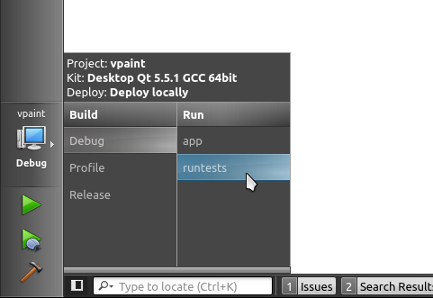

# Why writing unit tests?

Writing a unit test for each C++ class is highly encouraged for a few reasons:

  1. It is a sanity check that the class works as intended before usage by client code.
  2. It documents how to use the class.
  3. It helps to check automatically that new commits do not break existing functionality.
  4. It encourages good class design, and especially decoupling between classes, 
     since it is harder to write unit tests for coupled classes.

Though, there are indeed many cases when writing a unit test would be very
time consuming and might not be worth doing, especially for Gui code. For each
line of code you write, use your best judgement and common-sense to decide
whether it is worth testing.

It is a good practice to systematically write one or two lines of testing code
every 30 minutes or so. This actually makes  programming more fun
(satisfaction to see the code doing what's intended!), instead of the daunting
task of writing tests for a whole new class after a week of programming.

Note: Code in src/app/ cannot be tested because it does not generate a library
that can be linked against. That's why most of the code should be in src/libs/.

# How to write a unit test?

Writing a unit test is dead simple. Just create a .cpp file whose name starts with 'tst_', anywhere
in the tests/unit/ folder (for instance: tests/unit/MyLib/tst_Foo.cpp), with the following content:

```cpp
#include "Test.h"
/* Write more includes here */

/* Write helper functions here */

BEGIN_TESTS

/* Write tests here */

END_TESTS
```

Then, just write your test functions. You can name them whatever you like.
Here is an example:

```cpp
#include "Test.h"
#include "MyLib/Foo.h"

BEGIN_TESTS

void makeAndDestroyFoo()
{
    MyLib::Foo fooOnTheStack;
    MyLib::Foo * fooOnTheHeap = new MyLib::Foo();
    delete fooOnTheHeap;
}

void return42()
{
    MyLib::Foo foo;
    QCOMPARE(foo.return42(), 42);
}

END_TESTS
```

That's it. You're done. Nothing else to do. No need to create or modify a project file to
register the test, or specify which library the test should link to. All of
this is auto-magically taken care for you.

# How to run your test?

If you're using QtCreator, which I recommend, select the *runtests*
application in the *Build and Run Kit Selector* and run it (Ctrl+R).



Here is how it looks:

(TODO: add a screenshot here)

Simply navigate to your test using the tree view on the left, and click the
corresponding run button (green arrow). Your test will be compiled and run,
and you will see the output on the right.

You can keep the runtests application open while you write a unit test: just
save your changes in QtCreator (or whatever editor), and click the run button
again. The test will be re-compiled and re-run. Though, for now, you have to restart
runtests if you create a new test file.

# How to run your test outside QtCreator?

The *runtests* application that is launched by QtCreator using the above
instructions is in fact part of the VPaint git repository and is compiled
alongside VPaint. You will find it in the tests/runtests/ folder of your build
directory.

For instance, if you compiled VPaint like so:

```shell
$ git clone https://github.com/dalboris/vpaint.git vpaint
$ mkdir build-vpaint
$ cd build-vpaint
$ qmake ../vpaint
$ make
```

Then you can launch *runtests* this way:


```shell
$ cd tests/runtests
$ ./runtests
```

Depending on your platform, most likely on Windows, you might have to ensure that the appropriate Qt dlls can be found or
runtests might complain about missing dlls. Just launch runtests within QtCreator if you have any trouble, since it does
that for you.


# Command-line arguments

Additionaly, you can provide an argument to specify which tests to run. In this case,
it would not launch a Gui application, but instead just run the tests, print the result
in the console, and exits. The return code is 0 if all tests passed, 1 if at least one test failed.

Here is how to run all tests:

```shell
$ ./runtests all
```

Here is how to run all tests in a given folder:

```shell
$ ./runtests unit/Core
```

And here is how to run a specific test (filename without the `.cpp` extension):

```shell
$ ./runtests unit/Core/tst_foo
```

Note that the path provided as an argument must be relative to src/tests/, not relative to the current working directory.
